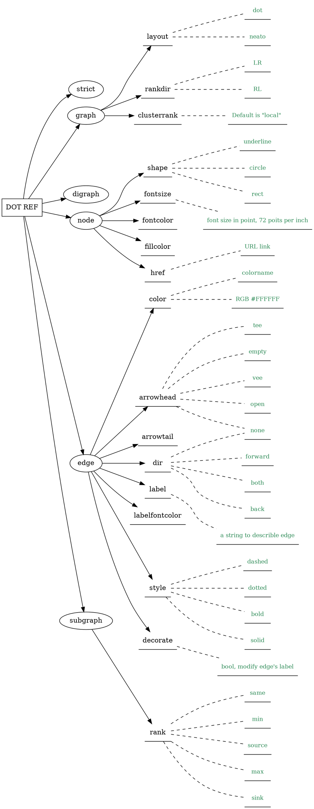
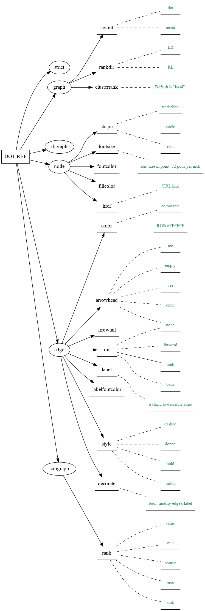

# 一些流览过的东西

经常会去浏览到一些的软件，最后各种书签，各种保存，隔了一段时间后还是忘了，有点时候甚至只是简单的想要想起那个软件或者代码的名字也不可得，因此，在这里列一个清单，用最为原始的方式把这些作一个记录。

## web.go

原来用浏览python的web框架的时候，看到过web.py，在golang中有个小的框架，记录一下。


## talib

Talib时一个用c写的计算市场价格的技术指标，有一个js的封装，自己在利用`mdbook`写文章的时候，曾经也用到一个`python`的封装包，是从futu的openAPI中得到这个信息。

其hello world程序是可以列出所有支持的函数，自己用`coffeescript`改了一下它的demo如下：

```coffeescript

talib = require 'talib'
{ log } = console

log "TALib Version: #{talib.version}"

functions = talib.functions

for i in [0...functions.length]
	log functions[i].name

func_desc = talib.explain "ADX"
console.dir func_desc

```

## svelte

这个是一个服务器端渲染的前端框架，自己如果想开发web界面的桌面应用，这个可能是一个比较好的选择：思路就是在本机上开发出来，然后将这个硬编码到go语言开发的后段逻辑的实现中，这样因为go语言自带的web服务器启动后，就客户的浏览器作为应用程序的前端，可以极大的简化开发和部署---因为go可以编译成独立的可执行文件，没有依赖。整个程序可能比用`electron`等体积要小得多。

## readline

Golang编译出来的可执行文件没有依赖性，这个对自己是一个非常大的诱惑。除了考虑利用浏览器作为客户界面的开发方式，对于纯粹的命令行开发方式也是非常好的。

如果开发命令行程序，对于处理输入的问题是相当关键的，其中特别涉及到与键盘的交互，`readline`这个包还是比较给力的。同样，放上一个简单的`hello world`:

```go

package main

import (
	"fmt"
	"math/rand"
	"time"

	"github.com/chzyer/readline"
)
import "log"

func main() {
	rl, err := readline.NewEx(&readline.Config{
		UniqueEditLine: true,
	})
	if err != nil {
		panic(err)
	}
	defer rl.Close()

	rl.SetPrompt("username: ")
	username, err := rl.Readline()
	if err != nil {
		return
	}
	rl.ResetHistory()
	log.SetOutput(rl.Stderr())

	fmt.Fprintln(rl, "Hi,", username+"! My name is Dave.")
	rl.SetPrompt(username + "> ")

	done := make(chan struct{})
	go func() {
		rand.Seed(time.Now().Unix())
	loop:
		for {
			select {
			case <-time.After(time.Duration(rand.Intn(20)) * 100 * time.Millisecond):
			case <-done:
				break loop
			}
			log.Println("Dave:", "hello")
		}
		log.Println("Dave:", "bye")
		done <- struct{}{}
	}()

	for {
		ln := rl.Line()
		if ln.CanContinue() {
			continue
		} else if ln.CanBreak() {
			break
		}
		log.Println(username+":", ln.Line)
	}
	rl.Clean()
	done <- struct{}{}
	<-done
}

```

有客户服务器端的分离，这是一个简单的消息程序。

## Python Playground

一本关于`python`的极客的书中用到一些代码，代码是不是最重要，烧脑的是那样程序背后的算法和想法，还有对一些有特色的`python`第3方库的使用上。

将书的作者的README直接放上来：

> 


Code for all the projects in the book Python Playground published by
No Starch Press, USA.

You can find more information about the book [here][1].

The source code is published here as per the MIT License below:

[1]: http://www.nostarch.com/pythonplayground

里面提到的网站上还有很多类似的项目，值得一看。

## Johnny-five

这个玩`Andurio`看到的，本身`Andurio`或者`Rapeipy`应该的重点应该是在对硬件的熟悉上，软件部分一旦与硬件调通，其实没有很多的东西，一段的API。

有好几个类似的平台，但是`Johnny-five`应该是最为稳定的，自己一下就调通了。放上用`coffeescript`的代码：

```coffeescript

five = require "johnny-five"
board = new five.Board()

board.on 'ready', ->
	console.log 'Ready event, REPL instance auto-initialized.'

	led = new five.Led 11

	@repl.inject
		led: led

	led.pulse
		easing: 'linear'
		duration: 1000
		cuePoints: [0, 0.2, 0.4, 0.6, 0.8, 1]
		keyFrames: [0, 10, 0, 50, 0, 255]
		onstop: ->
			console.log 'Animation stopped.'

	@wait 3000, ->
		led.fadeOut()

	@on 'exit', ->
		led.off()

```

上面是led的demo， 还有一个控制管脚的：

```coffeescript

five = require 'johnny-five'
temporal = require 'temporal'

board = new five.Board()

board.on 'ready', ->
	events = []
	strobe = new five.Pin 13

	temporal.loop 500, (loops)->
		state = if loops.called % 2 is 0 then "high" else "low"
		strobe[state]()

	exploreState = (state)->
		strobe.on state, ->
			unless state in events
				console.log 'Event emitted for:' ,state, 'on', @addr
				events.push state

	exploreState state for state in ['high', 'low']

	analog = new five.Pin 'A0'

	analog.query (state)->
		console.log state

```

## awk

这个不多说，原来一直没有认真看一下，现在看却是不错，尤其是语言作者本身写了一本关于`awk`的书，有点老，但是有价值的东西不会随时间而流逝的。

放一点点code：

```awk

# program to print a file with a header and footer

BEGIN { 
	print "NAME	RATE	HOURS"
	print ""
}

{
	if ($3 > 7)
		emp = emp + 1
	pay = pay + $2 * $3
	if ($2 > maxrate) { 
		maxrate = $2
		maxemp = $1
	}
	names = names $1 " " 
	last = $0 
	print $1, length($1) 
	nc = nc + length($0) + 1
	nw = nw + NF

	if ( $2 > 16) {
		n = n +1
		pay = pay + $2 * $3
	}
}

END {
	print emp, "employees worked more than 7 hours" 
	print NR, "employees"
	print "total pay is", pay
	print "average pay is", pay / NR
	print "highest hourly rate:", maxrate, "for", maxemp
	print names
	print last
	print NR,"lines", nw, "words", nc, "characters"

	if (n > 0) 
		print n, "employees, total pay is", pay, "average pay is", pay/n
	else
		print "no employees are paid more than $6/hours"
}

```

这个代码完整。

还有一个支票的格式问题，关键是把数字转换成单词表示，整个程序的重点都在那个上面了，也放上来：

```awk


# prechecks  - print formatted checks
# 	input: number \t amount \t payee
#	output: eight lines of text for preprinted check forms

BEGIN {
	print "Input check No, pay amount, and payee with sep by TAB:"
	FS = "\t"
	dashes = sp45 = sprintf("%45s", " ")
	gsub(/ /, "-", dashes) # to protect the payee
	"date" | getline date	# get today's date
	split(date, d, " ")
	date = d[2] " " d[3] ", " d[1]
	initnum() 	# set up tables for number conversation
}

{
	if (NF != 3 || $2 >= 1000000) {
		printf("\n line %d illegal: \n %s \n \n VOID \n VOID \n \n \n", NR, $0)
		next
	}

	printf("\n")
	printf("%s %s \n", sp45, $1)
	printf("%s %s \n", sp45, date)
	amount = sprintf("%.2f", $2)
	printf("Pay to %45.45s	$%s \n", $3 dashes, amount)
	printf("The sum of %s \n", numtowords(amount))
	printf("\n\n\n")
}

function numtowords(n, cents,dols) {
	cents = substr(n, length(n)-1, 2)
	dols = substr(n, 1, length(n) - 3)
	if (dols == 0)
		return "zero dollars and " centes " cents exactly"
	return inttowords(dols) " dollars and " cents " cents exactly"
}

function inttowords(n) {
	n = int(n)
	if (n >= 1000)
		return inttowords(n/1000) " thousand " inttowords(n%1000)
	if (n >= 100)
		return inttowords(n/100) " hundered " inttowords(n%100)
	if (n >= 20)
		return tens[int(n/10)] " " inttowords(n%10)
	return nums[n]
}

function initnum() {
	split("one two three four five six seven eight nine " \
		  "ten eleven twelve thirteen fourteen fifteen " \
		  "sixteen seventeen eighteen nineteen", nums, " ")
	split("ten twenty thirty forty fifty sixty " \
		  "seventy eighty ninety", tens, " ")
}

```

后面3个函数的代码可以copy&paste一下，呵呵。

下面是一个简单的计算利息的工具，有点小意思，这样的应用利用`awk`来写是最合适的。

```awk


# interst - compute compound interest
# input : amount rate years
# ouput: compounded value at the end of each year

BEGIN {
	print "amount\t rate\t year"
	getline x
	print x
}

{
	i = 1
	while (i <= $3) {
		printf("\t%0.2f\n", $1 * (1 + $2)^i)
		i = i + 1
	}
	
	print "use for loop:"
	for (i =1; i <= $3; i++)
		printf("\t%0.2f\n", $1 * (1 + $2)^i) >> "interest.dat"

	# Reverse - print input in revers order by line

	line[NR] = $0 # store each line in arrary
}

END {
	i = NR # pirnt lines in reverse order
	while (i > 0) {
		print line[i]
		i--
	}
}

```

### 用AWK分析成绩

儿子全校的成绩，本来想花点时间和儿子一起做一个小程序来分析一下， 但是儿子照样不感兴趣，也就是放弃了。

把[成绩的文件](stuff/scores.csv)和写的几行代码先放这里， 以后有机会再搞搞。

```awk

#! /usr/bin/awk -f

BEGIN {
	FS = ","
	if (ARGC == 3) {
		name = ARGV[2]
		ARGV[2] = ""
	}
	print "\t\t", "查分系统"
	print "\t\t", "********"
}

{
	if ($1 == name || $2 == name)  {
		print "\t", "学号：","\t", $1
		print "\t", "姓名：","\t", $2
		print "\t", "语文：","\t", $3
		print "\t", "数学：","\t", $4
		print "\t", "英语：","\t", $5
		print "\t", "----------------------"
		print "\t", "总分：","\t", $3+$4+$5
		printf("\t平均分：\t %.2f\n", ($3+$4+$5)/3)
	}
}

```


再说一下，那本`awk`作者自己关于`awk`的书真心不错。

## shell

用shell写过一些东西：

- 用futu openAPI抓取数据，利用gnuplot作图，这个当然没有啥意思

```shell

#!/bin/bash

# Define the CONSTANT
CODE=$1 #The stock code
START=$2:00 #The start time with fmt: '2018-11-09 15:33:00' for 1 minutes k line
END=$3:00 #The end time with same fmt as START
DIR=img #Create one img dir to store the png under current dir
PNG=$1-${START:0:10}-${START:11}.png #Name the png with different name
TMP=tmp.dat

mkdir -p $DIR && cd $DIR

# Grasp the data from futu
(python <<- EOF
from futuquant import *
import pandas as pd
pd.set_option('display.max_rows',None)

quote_ctx = OpenQuoteContext()
ret, data, page_req_key = quote_ctx.request_history_kline('$CODE',
start   = '$START',
end     = '$END',
ktype   = KLType.K_1M,
fields  = [KL_FIELD.DATE_TIME, KL_FIELD.OPEN, KL_FIELD.LOW, KL_FIELD.HIGH, KL_FIELD.CLOSE],
max_count = 180
)
print(data)
quote_ctx.close()
EOF
) | awk '$1!="code" {print $4,$5,$6,$7,$8}' > $TMP

gnuplot <<- EOF
set terminal png enhanced font "arial,10"
set style fill empty
set title "$CODE\n$2=>$3"
set xtic font "arial,6"
set ytic font "arial,8"
set autoscale
set grid
set xdata time
set timefmt "%H:%M"
set style data candlesticks
set output "$PNG"

plot "$TMP" using 1:2:3:4:5 notitle
EOF

#Output the png link for used in markdown file
echo ''

# Remove the tmp file
rm -f $TMP
cd - # Reurn working dir

```

- 一个利用mathomatic来解方程的小东西，主要想吸引儿子的注意力，最后还是失败，嗯：

```shell

#!/bin/sh

# A simple program to use mathomatic to solve the equations
echo 你想要解二元一次方程组还是三元一次方程组？[2/3]
read nu

if [[ $nu = '3' ]]; then

    echo Enter 3 equations:
    read equation1
    read equation2
    read equation3

    mathomatic -q << EOF

        ; Use the mathomatic to solve the 3 simultnaeous line equations

        clear all ; restart Mathomatic

        ; enter all 3 quations:
        $equation1
        $equation2
        $equation3

        repeat echo -

        2 ; select equation number 2 as the current equation

        eliminate x ; eliminate variable x from the current equation

        3 ; select equation 3

        eliminate x y ; eliminate x and y from equation 3, use equation 1 for x and equation 2 for y

        solve for z ; get z

        2 ; select equation 2,as we have eliminated x and y, equation 2 just include z

        eliminate z using 3 ; find y

        simplify ; get y

        1 ;select equtation 1

        eliminate z using 3, y using 2 ; find x

        echo All results as below:
        repeat echo -

        simplify all
EOF
elif [[ $nu = '2' ]]; then

    echo Enter 2 equations:
    read equation4
    read equation5

    mathomatic -q << EOF

        clear all ; restart Mathomatic
        ; enter 2 equations:
        $equation4
        $equation5

        repeat echo -

        2 ; select equation 2

        eliminate x

        solve for y

        1 ; now select equation 1

        eliminate y using 2

        echo 2 results are below:
        repeat echo -

        simplify all

EOF

else
    echo Wrong enter! >&2
fi

```

还有自己真正在用的一个脚本，用来开发票的。

## docsify

用个做了一个技术文档的网页，完全的客户端渲染，是一种思路，支持的插件等也可以将支持的格式极大化，目前看是非常全的。

由于完全的客户端渲染，因此开始的速度是喜人的。同时还有一些别的原因，将这个还是放弃了。这个别的原因当然与docsify本身无关。

## MDP

一个终端的ppt软件，挺好的，将它自己提供的sampel.md看一下就行了：

```markdown


%title: mdp - Sample Presentation
%author: Robbin He
%date: 2019-06-06

-> mdp <-
=========

-> A command-line based markdown presentation tool. <-

_Basic controls(基本的控制方式):_

next slide      *Enter*, *Space*, *Page Down*, *j*, *l*,
                *Down Arrow*, *Right Arrow*

previous slide  *Backspace*, *Page Up*, *h*, *k*,
                *Up Arrow*, *Left Arrow*

quit            *q*
reload          *r*
slide N         *1..9*
first slide     *Home*, *g*
last slide      *End*, *G*

-------------------------------------------------

-> # Supported markdown formatting <-

The input file is split into multiple slides by
horizontal rules (hr). A hr consisting of at
least 3 *\** or *-*. It can also contain spaces but
no other characters.

Each of these represents the start of a new slide.

\* \* \*
\---
\*\*\*\*\*\*\*\*\*\*\*\*\*\*\*\*\*\*\*\*\*\*\*\*
\- - -

-------------------------------------------------

-> # Supported markdown formatting <-

First-level headers can be prefixed by single *#*
or underlined by *===*.

\# first-level

becomes

# first-level

-------------------------------------------------

-> # Supported markdown formatting <-

Second-level headers can be prefixed by *##* or
underlined by *---*.

second-level
\------------

becomes

second-level
------------


-------------------------------------------------

-> # Supported markdown formatting's <-

Inline codes are surrounded with backticks.

C program starts with \`main()\`.

becomes

C program starts with `main()`.

-------------------------------------------------

-> # Supported markdown formatting <-

Code blocks are automatically detected by 4 spaces
at the beginning of a line.

Tabs are automatically expanded to 4 spaces while
parsing the input.

\    int main(int argc, char \*argv[]) {
\        printf("%s\\n", "Hello world!");
\    }

becomes

    int main(int argc, char *argv[]) {
        printf("%s\n", "Hello world!");
    }

-------------------------------------------------

-> # Supported markdown formatting <-

You can also use [pandoc](http://pandoc.org/demo/example9/pandocs-markdown.html)'s fenced code block
extension. Use at least three ~ chars to open and
at least as many or more ~ for closing.

\~~~ {.numberLines}
\int main(int argc, char \*argv[]) {
\    printf("%s\\n", "Hello world!");
\}
\~~~~~~~~~~~~~~~~~~

becomes

~~~ {.numberLines}
int main(int argc, char *argv[]) {
    printf("%s\n", "Hello world!");
}
~~~~~~~~~~~~~~~~~~

Pandoc attributes (like ".numberlines" etc.)
will be ignored

-------------------------------------------------

-> # Supported markdown formatting <-

You can also use [github](https://guides.github.com/features/mastering-markdown/#GitHub-flavored-markdown) flavored markdown's
code block. Use at least three backticks to open
and at least as many or more backticks for closing.

\```
\int main(int argc, char \*argv[]) {
\    printf("%s\\n", "Hello world!");
\}
\```

becomes

```
int main(int argc, char *argv[]) {
    printf("%s\n", "Hello world!");
}
```

Language hint will be ignored

-------------------------------------------------

-> # Supported markdown formatting <-

Quotes are auto-detected by preceding *>*.

Multiple *>* are interpreted as nested quotes.

\> quote
\>> nested quote 1
\> > nested quote 2

becomes

> quote
>> nested quote 1
> > nested quote 2

-------------------------------------------------

-> # Supported markdown formatting <-

Inline highlighting is supported as followed:

\- *\** colors text as red
\- *\_* underlines text

\_some\_ \*highlighted\* \_\*text\*\_

becomes

_some_ *highlighted* _*text*_

-------------------------------------------------

-> # Supported markdown formatting <-

Backslashes force special markdown characters
like *\**, *\_*, *#* and *>* to be printed as
normal characters.

\\\*special\\\*

becomes

\*special\*

-------------------------------------------------

-> # Supported markdown formatting <-

Leading *\** or *-* indicate lists.

list
\* major
\    - minor
\        - \*important\*
\          detail
\    - minor

becomes

list
* major
    - minor
        - *important*
          detail
    - minor

-------------------------------------------------

-> # Supported markdown formatting <-

A single *\<br\>* or *^* in a line indicates mdp
to stop the output on that position.

This can be used to show bullet points
line by line.

*\<br\>* is also not displayed in HTML converted
output.

Agenda
<br>
* major
<br>
    * minor
<br>
* major
  ^
    * minor
      ^
        * detail

-------------------------------------------------

-> # Supported markdown formatting <-

Leading *->* indicates centering.

\-> # test <-
\-> ## test <-
\-> test
\-> \_\*test\*\_ <-

becomes

-> # test <-
-> ## test <-
-> test
-> _*test*_ <-

-------------------------------------------------

-> # Supported markdown formatting <-

URL in pandoc style are supported:

\[Google](http://www.google.com/)

becomes

[Google](http://www.google.com/)

-------------------------------------------------

-> ## More information about markdown <-

can be found in the [markdown documentation](http://daringfireball.net/projects/markdown/).

-------------------------------------------------

-> # Support for UTF-8 special characters <-

Here are some examples.

ae = ä, oe = ö, ue = ü, ss = ß
upsilon = Ʊ, phi = ɸ

▛▀▀▀▀▀▀▀▀▀▜
▌rectangle▐
▙▄▄▄▄▄▄▄▄▄▟


-------------------------------------------------

-> # Suspend your presentation for hands-on examples <-

Use *Ctrl + z* to suspend the presentation.

Use *fg* to resume it.

-------------------------------------------------

-> # Convert your presentation to PDF <-

To publish your presentation later on, you may
want to convert it to PDF.

This can be achieved by two additional tools:

\- *markdown* to convert to HTML
\- *wkhtmltopdf* to convert from HTML to PDF

After installing them, you can simply type:

    $ markdown sample.md | wkhtmltopdf - sample.pdf

-------------------------------------------------

-> ## Last words <-

I hope you like *mdp*.

If you observe strange behavior, feel free to
open an issue on [GitHub](https://github.com/visit1985/mdp).

```

## Book list (update in 2019-07-14)

这是一些自己收集的pdf，放在自己主目录的books目录下。


Callback Hell.pdf
Go 1.5 源码剖析.pdf
LINUX SHELL脚本攻略(中文版带书签).pdf
PlantUML_Language_Reference_Guide_zh.pdf
The Little Book on CoffeeScript.pdf
The _principles_of_least_action.pdf
TheLinuxCommandLine.pdf
The_AWK_Programming_Language_zh_CN.pdf
Vim实用技巧.pdf
[啊哈！算法].啊哈磊.扫描版.pdf
programmingwithgo.pdf
《算法神探》一口气就能看完的神奇算法书.pdf
啊哈c语言.pdf
学习 Linux，101: 使用基本 SQL 命令.pdf
日本蜡烛图技术.pdf
日本蜡烛图教程.PDF


## ngspice

用来电路仿真的开源软件，命令行格式，要是有时间，可以将电子学课本的一些内容拿到这个上面来仿真。

现在越来越感觉自己的大学太浪费时间了，这么多的好东西都不知道，更别说去研究。这些都是多么有意思的东西，看这儿子对这些都不感兴趣，真的有一些心疼。

放一个简单的DEMO代码：

```

A Berkeley SPICE3 compatible circuit

.tran 1e-5 2e-3

vcc vcc 0 12.0
vin 1 0 0.0 ac 1.0 sin(0 1 1k)
ccouple 1 base 10uF
rbias1 vcc base 100k
rbias2 base 0 24k
q1 coll base emit generic
rcollector vcc coll 3.9k
remitter emit 0 1k

.model generic npn

.end
```

基本的一些命令有`listing`, 'run`, 'plot`等。

## dot

 发现的好东西很多，很多都是比较古老的东西，其实都是现在看上去非常时髦的软件的内核。DOT就是这样的一个软件。

注意到在LINUX上安装`graphviz`， 带有个DOTTY的可视化编辑器，当然没有很多的用处，但是由于字体问题， 可以安装新的一个包，大概是`xorg-misc`,同样的问题在前面的NGSPICE软件上也是存在的， 这里一块说一下。好像这个主要还是在ARCHLINUX才有的问题。

DOT的语法相当简单，自己将常用的语法用DOT总结了一下，这里放上来：


产生的输出呢，见下面：



## GIT

GIT大名鼎鼎，不多说。在我的MANJARO和MAC之间同步文件，以前都没有很好的利用起来。

总结一下：

首先到自己的GITHUB帐号下建立一个空的仓库，CLONE下来，在自己的本地电脑上的工作就在这个CLONE下来的文件夹下面工作。而在本地建立好仓库在添加到远程仓库容易出现问题。

这个就是说，任何在本地电脑上的操作，或者想建立新的文件夹，不如去GITHUB上开立一个新的仓库。进一步，当自己的在本地电脑上使用`mkdir`命令的时候，心里要掂量一下有没有必要，还是直接到哦啊GITHUB上建立空的仓库更好。

简单的3个步骤：

- git add *
- git commint -m msg
- git push origin master

可以将这三个命令结合在一起，看上去还是没有必要性，尤其是第二步，写一个好的COMMIT MESSAGE是一个非常重要的工作，没有必要简化。

今天在GITHUB上新建仓库的时候，居然发现可以建立私有的仓库，以前好像这个是要收费的哦。

